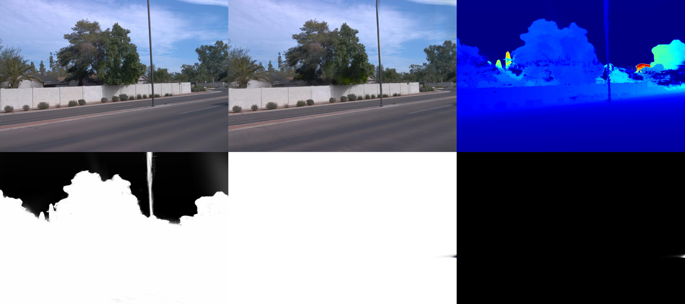

<!DOCTYPE html>
<html lang="zh-CN">
<head>
<meta charset="utf-8">
<title>陆韬宇的个人网页</title>
<!-- Stylesheets -->
<link href="css/bootstrap.css" rel="stylesheet">
<link href="css/style.css" rel="stylesheet">
<link href="css/responsive.css" rel="stylesheet">

<!--Favicon-->
<link rel="shortcut icon" href="images/favicon.png" type="image/x-icon">
<link rel="icon" href="images/favicon.png" type="image/x-icon">
<!-- Responsive -->
<meta http-equiv="X-UA-Compatible" content="IE=edge">
<meta name="viewport" content="width=device-width, initial-scale=1.0 ,maximum-scale=1.0 , user-scalable=0">

<!-- 上一行不使用这个参数maximum-scale=1.0  user-scalable=0 -->
<!--[if lt IE 9]><![endif]-->
<!--[if lt IE 9]><![endif]-->
</head>

<body>

 	
    <!-- Preloader -->
    

    

        

        

        <canvas id="canvas"></canvas>
    

    
    <!-- Mobile menu -->
    

        

            <!--Nav Outer-->
            

                

                <!-- Main Menu -->
                <nav class="main-menu">
                    

                        <!-- Toggle Button -->      
                        <button type="button" class="navbar-toggle" data-toggle="collapse" data-target=".navbar-collapse">
                            
                            
                            
                        </button>
                    

                    
                    

                        <ul class="navigation clearfix">
                            
                            <li class="current"><a href="#home">Home</a></li>
                            <li><a href="#about">About</a></li>
                            <li><a href="#resume">Resume</a></li>
                            <li><a href="#services">Awards</a></li>
                            <li><a href="#work">Works</a></li>
                            <li><a href="#blog">Blog</a></li>
                            <li><a href="#contact">Contact</a></li>

                         </ul>
                    

                </nav>
                <!-- Main Menu End-->                        
            

            <!--Nav Outer End-->            
        

    

 	
    

        

            

                

                    

                        

                        

                            <h3> 陆韬宇</h3>
                            

                                Hi i am
                                

                                    
a <strong>CQU student(CQUer).</strong>

                                    
a <strong>programmer.</strong>

                                    
a <strong>photographer.</strong>

                                

                                
                            

                        

                        

                            <a href="images/cv.pdf" class="theme-btn btn-style-one">Download CV</a>
                        

                        <ul class="social-icon-two">
                            <li><a href="images/qrcode/wechat-qrcode.jpg" target="_blank" title="微信二维码"></a></li>
                            <li><a href="images/qrcode/qq-qrcode.jpg" target="_blank" title="QQ二维码"></a></li>
                            <li><a href="images/qrcode/tiktok-qrcode.jpg" target="_blank" title="抖音二维码"></a></li>
                        </ul>
                    

                    

                        <header class="header wow fadeInLeft" data-wow-duration="1.5s">
                            <ul class="main-menu">
                                <li class="active home"></li>
                                <li><a href="#about"><i class="flaticon-social"></i>About</a></li>
                                <li><a href="#resume"><i class="flaticon-curriculum"></i>Resume</a></li>
                                <li><a href="#services"><i class="flaticon-layers-1"></i>Awards</a></li>
                                <li><a href="#work"><i class="flaticon-tools"></i>Works</a></li>
                                <li><a href="#blog"><i class="flaticon-blog"></i>Blog</a></li>
                                <li><a href="#contact"><i class="flaticon-send-mail"></i>Contact</a></li>
                            </ul>
                        </header>

                        <!-- card item -->
                        

                            

                                

                                

                                    <h3> 陆韬宇</h3>
                                    

                                        Hi i'm
                                        

                                            
a <strong>CQU student(CQUer).</strong>

                                            
a <strong>programmer.</strong>

                                            
a <strong>photographer.</strong>

                                        

                                        
                                    

                                

                                
我是来自重庆大学的陆韬宇，欢迎来到我的空间

                                

                                    <a href="images/cv.pdf" class="theme-btn btn-style-one">下载我的简历</a>
                                    <!--###################################################################-->
                                    <a href="https://fishsix20236356.github.io/middlepage/" class="theme-btn btn-style-two">访问我的秘密基地</a>
                                

                                <ul class="social-icon-two">
                                    <li><a href="images/qrcode/wechat-qrcode.jpg" target="_blank" title="微信二维码"></a></li>
                                    <li><a href="images/qrcode/qq-qrcode.jpg" target="_blank" title="QQ二维码"></a></li>
                                    <li><a href="images/qrcode/tiktok-qrcode.jpg" target="_blank" title="抖音二维码"></a></li>
                                </ul>
                            

                            
                        

                        <!-- end item -->

                        <!-- card item -->
                        

                            

                                <h4 class="title">About Me</h4>
                                
陆韬宇，CQUer，对深度学习技术，尤其是三维重建与时间序列预测领域感兴趣。

                                

                                    

                                        

                                            <ul class="list-style-one">
                                                <li><strong>Name:</strong>  陆韬宇</li>
                                                <li><strong>Phone:</strong>  13350396440</li>
                                            </ul>
                                        

                                        

                                            <ul class="list-style-one">
                                                <li><strong>Email:</strong>  lutaoyu@stu.cqu.edu.cn   3899613198@qq.com</li>
                                            </ul>
                                        

                                    

                                
                                    
                                <h4 class="title">Skills</h4>
                                

                                    <!-- About Block -->
                                    

                                        

                                            

                                                <input type="text" class="dial" data-fgColor="#9147ff" data-bgColor="#f5f5f5" data-width="90" data-height="90" data-linecap="normal"  value="80">
                                                
%

                                            

                                            <h3>python&pytorch</h3>
                                        

                                    

                                    <!-- About Block -->
                                    

                                        

                                            

                                                <input type="text" class="dial" data-fgColor="#ff5e7e" data-bgColor="#f5f5f5" data-width="90" data-height="90" data-linecap="normal"  value="50">
                                                
%

                                            

                                            <h3>javascript</h3>
                                        

                                    

                                    <!-- About Block -->
                                    

                                        

                                            

                                                <input type="text" class="dial" data-fgColor="#ffc713" data-bgColor="#f5f5f5" data-width="90" data-height="90" data-linecap="normal"  value="30">
                                                
%

                                            

                                            <h3> vue & vite</h3>
                                        

                                    

                                    <!-- About Block -->
                                    

                                        

                                            

                                                <input type="text" class="dial" data-fgColor="#51dbc3" data-bgColor="#f5f5f5" data-width="90" data-height="90" data-linecap="normal"  value="0">
                                                
%

                                            

                                            <h3>CUDA </h3>
                                        

                                    

                                

                                        
                            

                        

                        <!-- end item -->

                        <!-- card item -->
                        

                            

                                <h4 class="title">Resume</h4>
                                

                                    
                                    <!--Column-->
                                    

                                        

                                            

 <h2>教育经历</h2>

                                            
                                            <!--Timeline Block-->
                                            

                                                

                                                    <h4>本科阶段</h4>
                                                    
2023-2028 / 重庆大学

                                                    
电气工程及其自动化专业，爱好旅行,DL与coding,关注时间序列与三维重建领域

                                                

                                            

                                                                   
                                        

                                    

                                    
                                    <!--Column-->
                                    

                                        

                                            

 <h2>科研经历</h2>

                                            
                                            <!--Timeline Block-->
                                            

                                                

                                                    <h4>SRTP(大学校园学生才艺技能社交平台的研发)</h4>
                                                    
2023.10-2024.3  / CQU

                                                    
使用JavaScript开发小程序平台，准确把握市场动态

                                                

                                            

                                            

                                                

                                                    <h4>重庆大学视觉实验室{三维重建}</h4>
                                                    
2024.07-2025.04  / CQU

                                                    
成功复现3D Gaussian Splatting及Street Gaussian、S3Gaussian、HUGS、Driving Gaussian等模型 

                                                

                                            

                                            

                                                

                                                    <h4>市（国）创(大学生创新创业计划){时间序列}</h4>
                                                    
2024.10-2025.12   / CQU

                                                    
对time-LLM模型改进，将重编程机制与语义对齐机制整合进时序数据预测系统 

                                                

                                            

                                        

                                    

                                    
                                

                            

                        

                        <!-- end item -->
                        <!-- card item -->
                        

                            

                                <h4 class="title">Awards</h4>
                                

                                    

                                        

                                            

                                            <h4>iCan创新创业大赛国赛二等奖</h4>
                                            
对实验室科研成果“纳米磁流体”进行科技成果转化，制作商业计划书并路演

                                        
 
                                    

                                    

                                        

                                            

                                            <h4><a href="#">互联网+大学生创新创业大赛校级金奖</a></h4>
                                            
通过商业计划书，路演答辩等方式获得市场反馈，加速产品技术更新迭代，增长产品推广经验 

                                        
 
                                    

                                    

                                        

                                            

                                            <h4><a href="#">一起云支教优秀青年志愿者</a></h4>
                                            
观察家庭运作方式，教育问题，提前思考自己需要搭建什么样的家庭，如何教育子女

                                        
 
                                    

                                    

                                        

                                            

                                            <h4><a href="#">计图人工智能挑战赛优秀奖</a></h4>
                                            
尝试pytorch以外的框架，支持国产，训练自己对陌生代码库的灵活应变能力 

                                        
 
                                    

                                    

                                        

                                            

                                            <h4><a href="#">数学建模大赛校级优秀荣誉</a></h4>
                                            
提前去实验室实习，利用实验室经验降维打击数模比赛，后期期待更高荣誉

                                        
 
                                    

                                    

                                        

                                            

                                            <h4><a href="#">多智能体研究</a></h4>
                                            
成功复现 AMD 公司开源项目 AgentLab以及香港大学AI-Researcher,自己给自己搬个奖嘻嘻，不要在意荣誉，我只要愿意，可以随时给自己颁奖，再买个冰糖葫芦当奖品

                                        
 
                                    

                                

                            

                        

                        <!-- end item -->
                        <!-- card item -->
                        

                            

                                <h4 class="title">Works</h4>
                                

                                    <!--工作1内容的图片-->
                                    

                                        

                                            <figure class="image">
                                                
                                                

                                                    <a class="lightbox-image option-btn" title="Image Caption Here" data-fancybox-group="example-gallery" href="images/gallery/1.jpg">
                                                        <i class="fa fa-search"></i>
                                                    </a>                                
                                                

                                            </figure>
                                            

                                                <h4><a href="https://zju3dv.github.io/street_gaussians/">our work refer to street gaussian</a></h4>
                                                dynamic reconstruction,gaussian splatting
                                            

                                        

                                    

                                    <!--到这里结束-->

                                

                            

                        

                        <!-- end item -->
                        <!-- card item -->
                        

                            

                                <h4 class="title">Blog</h4>

                                <!--blog1-->
                                

                                    

                                        

                                            
                                            

                                                <a class="link-btn" href="blog-1.html">
                                                    <i class="fa fa-link"></i>
                                                </a>                                
                                            

                                        

                                        
<strong>Dec</strong>  2024

                                        

                                            <h4><a href="blog-1.html">心理学感悟</a></h4>
                                            
by Mr.Lu Taoyu  /  psychology

                                        

                                    

                                

                                <!--blog2-->
                                

                                    

                                        

                                            
                                            

                                                <a class="link-btn" href="blog-2.html">
                                                    <i class="fa fa-link"></i>
                                                </a>                                
                                            

                                        

                                        
<strong>Feb</strong>  2025

                                        

                                            <h4><a href="blog-2.html">有趣的想法</a></h4>
                                            
by Mr.AlexFish  /  thinking

                                        

                                    

                                

                                <!--blog3-->
                                

                                    

                                        

                                            
                                            

                                                <a class="link-btn" href="blog-3.html">
                                                    <i class="fa fa-link"></i>
                                                </a>                                
                                            

                                        

                                        
<strong>Feb</strong>  2025

                                        

                                            <h4><a href="blog-3.html">三维重建与时间序列</a></h4>
                                            
by Mr.Fishsix  /  search

                                        

                                    

                                

                            

                        

                        <!-- end item -->
                        <!-- card item -->
                        

                            

                                <h3 class="title">联系我</h3>
                                

                                    

                                        <ul class="list-style-two">
                                            <li>重庆大学虎溪校区   重庆市沙坪坝区大学城南路55号 </li>
                                            <li>13350396440 </li>
                                            <li>lutaoyu@stu.cqu.edu.cn   3899613198@qq.com</li>
                                        </ul>
                                    

                                

                                        
                            

                        

                        <!-- end item -->

                    

                

                    
            

        

            
    

<!--End pagewrapper-->

 

<!--Google Map APi Key-->

<!--End Google Map APi-->

</body>
</html>
